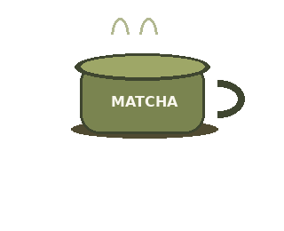

---
### About Me ★ 
Hi, I'm jas! A second-year BS Information Systems student and matcha enthusiast.

I'm interested in exploring technology, design, and problem-solving through computing.

---

### Currently Learning
- Web Development
- JavaScript & Web APIs
- Databases & Backend Development
- Data Structures & Algorithms
- Git & GitHub
- UI/UX & Responsive Design
- Deployment & Cloud Technologies

 

---

## Languages, Databases & Tools I’m Learning & Exploring

### Languages

### Databases

### Tools & Technologies

---

<b><i></b>powered by curiosity, creativity, and matcha ⋆˙⟡ </i></b>

